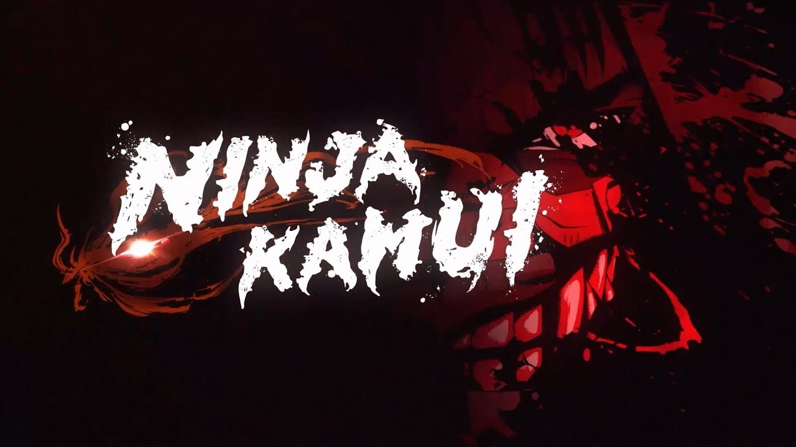

# 🥷 Anime-Ninja Kamui

Este é um projeto de site estático desenvolvido para apresentar o anime **Ninja Kamui**, com foco em **interface responsiva**, **organização de conteúdo por seções** e um **carrossel interativo de wallpapers**. Foi feito com HTML, CSS e JavaScript puro.

## 🌐 Link do Projeto

> *Em breve hospedagem no GitHub Pages ou Vercel!*

---

## 📸 Preview



---

## 📁 Estrutura do Projeto

```
Anime-Ninja-Kamui/
│
├── assets/
│   ├── css/
│   │   └── style.css        # Estilos customizados
│   ├── img/                 # Imagens do projeto (logo, episódios, wallpapers)
│   ├── js/
│   │   └── index.js         # Script de interações (menu e carrossel)
│   └── video/
│       └── videoplayback.mp4 # Vídeo de fundo
│
├── index.html               # Página principal
└── README.md                # Este documento
```

---

## 💡 Funcionalidades

- ✅ **Menu Responsivo** com ícone hamburguer para mobile
- ✅ **Sessão Hero** com sinopse e logo
- ✅ **Lista de Episódios** com imagem e descrição
- ✅ **Vídeo de Fundo** para imersão
- ✅ **Carrossel de Wallpapers** com miniaturas e navegação
- ✅ **Design Responsivo** adaptado para desktop e mobile

---

## 🧩 Tecnologias Utilizadas

- **HTML5**  
- **CSS3**
  - Flexbox
  - Media Queries
  - Animações
- **JavaScript Vanilla**
- **Font Awesome 4.7** (para ícone de menu)

---

## 🛠️ Como Usar

1. Clone o repositório:
   ```bash
   git clone https://github.com/seu-usuario/Anime-Ninja-Kamui.git
   ```

2. Acesse a pasta do projeto:
   ```bash
   cd Anime-Ninja-Kamui
   ```

3. Abra o `index.html` com seu navegador de preferência, ou use uma extensão como **Live Server** no VS Code.

---

## ✨ Melhorias Futuras

- [ ] Adicionar player com trailer do anime
- [ ] Implementar sistema de favoritos para episódios
- [ ] Dark mode automático
- [ ] Galeria com mais wallpapers
- [ ] Publicação do projeto em produção (GitHub Pages, Vercel, Netlify)

---

## 📸 Créditos

- Arte e informações: [Ninja Kamui - Adult Swim](https://www.adultswim.com)
- Imagens: retiradas de fontes promocionais oficiais
- Desenvolvimento por: **TPimenta**

---

## 📬 Contato

Se quiser trocar uma ideia sobre Front-End ou colaborar no projeto:

- ✉️ Email: tiagopimenta.ata@email.com  
- 💼 LinkedIn: https://www.linkedin.com/in/tipimenta

---

## 📄 Licença

Este projeto está sob a licença **MIT**. Sinta-se livre para usar, modificar e distribuir!
